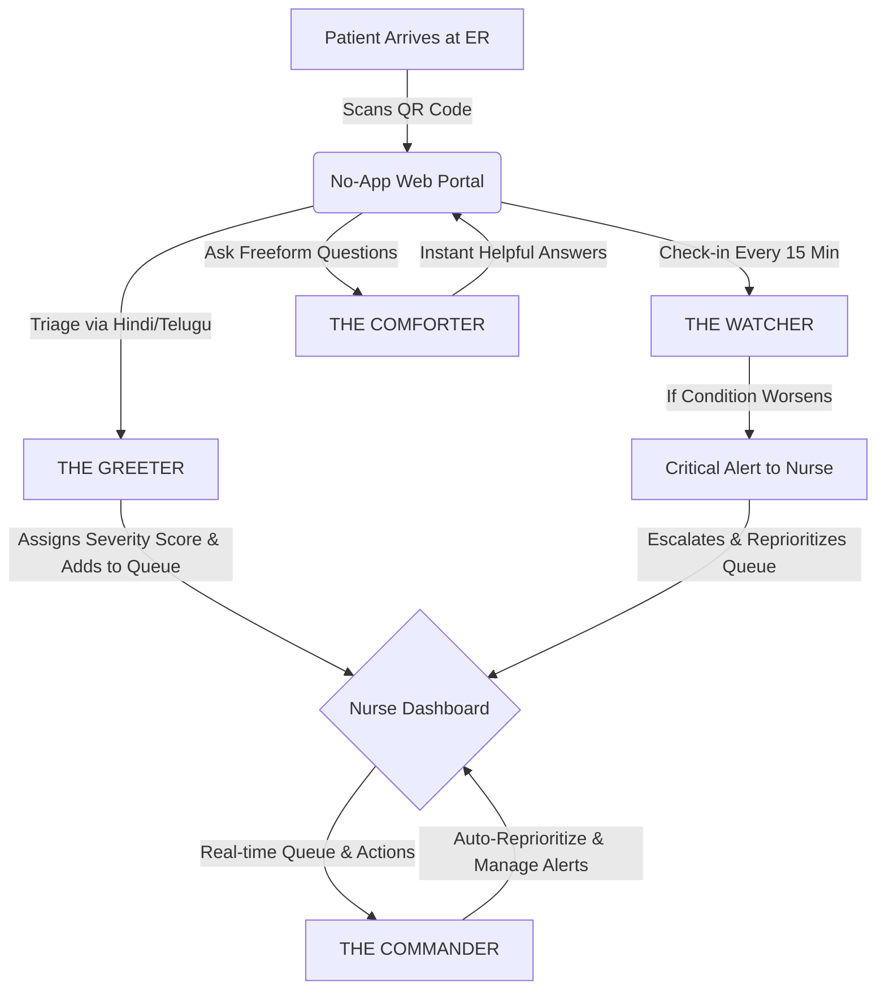

# 🏥 Arogya Watch AI: AI-Powered ER Waiting Room Monitoring System <a href="https://arogya-watch-ai-eydz.onrender.com" target="_blank"></a>

[](https://github.com/vamshi-2705/arogyaAI)
[](#)
[](#)
[](#)

**Arogya Watch AI** is India's first AI-powered Emergency Room (ER) waiting room monitoring system designed specifically for understaffed and overcrowded government hospitals. By turning patients' family members into monitored care partners via simple QR codes and localized WhatsApp-style chatbots, it ensures no patient deteriorates unnoticed in a waiting room again.

---

> [!IMPORTANT]  
> **"60 children died in a Gorakhpur government hospital in 6 days. Not because doctors didn't care. Because nobody was watching. One nurse. 200 patients. No monitoring system. No alerts. No early warning. This is the reality of Indian government hospitals today. We built the system. This is AROGYA WATCH AI."**

---

## 📌 Section 1: The Problem Statement
### *The Silent Emergency in India's Government Hospital Waiting Rooms*

In India's largest government hospitals, patients lie on floors while their conditions worsen undetected. This is not just an emergency—it is the daily reality.

| Stat | Impact | Description |
|---|---|---|
| **300%** | Average Occupancy | Government hospitals operate far beyond safe, designated capacities. |
| **2x** | Higher Mortality | For patients forced to wait over 12 hours without active observation. |
| **50+** | Patient-to-Nurse Ratio | One nurse frequently handles 50+ patients simultaneously, making manual monitoring impossible. |

### Why This Happens:
1. **Zero Waiting Room Monitoring:** ICU monitoring exists, but waiting rooms are completely unmonitored.
2. **Extreme Wait Times:** Patients wait 4 to 8 hours on average before being seen by a doctor.
3. **No Communication Channel:** Families have no structured way to report a worsening condition to nurses.
4. **Language Barriers:** Existing digital medical systems are in English, whereas patients and families speak local languages like Telugu, Hindi, or Tamil.
5. **No Hardware Budget:** Public hospitals cannot afford expensive sensors, cameras, or complex systems.

### Who Suffers:
*   **Patients:** Deteriorate silently in waiting rooms with zero monitoring. A condition can go from stable to critical in minutes undetected.
*   **Families:** Panicking with no information, no communication channel, and no way to alert nurses when their relative's condition worsens.
*   **Nurses:** Overwhelmed and unable to manually monitor 50+ patients. They run between beds, missing critical changes in vitals or patient state.
*   **Hospitals:** Legally liable when unmonitored patients deteriorate or die in waiting rooms. Reputation and public accountability are constantly at risk.

---

## 💡 Section 2: The Solution
### *AROGYA WATCH AI — India's First AI-Powered ER Waiting Room Monitor*

Arogya Watch AI turns every patient’s family member into a monitored care partner. Using multi-agent AI workflows, simple QR codes, and a WhatsApp-style chatbot in **Telugu** and **Hindi**, we bridge the gap between overloaded medical staff and patients.



### How It Works:
#### 👨‍👩‍👧‍👦 Patient & Family Flow:
1.  **Scan QR Code:** On arrival, the family scans a QR code. No app download is required—it opens instantly in any mobile browser.
2.  **AI Triage:** The AI chatbot asks 5 triage questions in the patient’s preferred language (Hindi/Telugu): *Main problem, pain level, duration, previous conditions, and current medications*.
3.  **Severity Scoring:** The AI assigns a severity score (Low / Medium / High / Critical) and places the patient in the priority queue automatically.
4.  **Continuous Check-ins:** Every 15 minutes, the AI chatbot checks in: *"Is the condition the same, better, or worse?"*
5.  **Family Support:** The family can ask questions anytime: *"How long will we wait?"*, *"Is this symptom normal?"* The AI answers instantly.

#### 🩺 Nurse & Staff Flow:
1.  **Central Dashboard:** A single tablet displays all waiting patients on a color-coded dashboard.
2.  **Visual Severity:** Patients are color-coded in real-time: **Green (Stable)** → **Yellow (Worsening)** → **Red (Critical)**.
3.  **Instant Escalations:** When a patient reports deterioration, an instant WhatsApp alert fires to the nurse with patient details and recommended actions.
4.  **Auto-Reprioritization:** The queue automatically reprioritizes based on real-time feedback—most critical patients bubble to the top.
5.  **Proactive Alerts:** The nurse sees which patients haven't responded to check-ins in too long, prompting proactive manual checks.

---

## 🤖 The 4 AI Agents

Arogya Watch AI coordinates four specialized agents to manage the triage and monitoring lifecycle:

| Agent | Purpose | Input / Output | Tech Underlying |
|---|---|---|---|
| **THE GREETER** | Check-in & Triage | **Input:** Patient symptoms in Telugu/Hindi <br>**Output:** Severity score + queue position + nurse alert | Claude 3.5 Sonnet |
| **THE WATCHER** | Continuous Monitoring | **Input:** Patient responses over time <br>**Output:** Condition trend + escalation alert if needed | Claude 3.5 Sonnet |
| **THE COMFORTER** | Patient Support | **Input:** Family questions in Telugu/Hindi <br>**Output:** Calm, accurate, reassuring answers instantly | Claude 3.5 Sonnet |
| **THE COMMANDER** | Dashboard & Queue Manager | **Input:** Combined patient data streams <br>**Output:** Prioritized nurse action list + WhatsApp alerts | Pure Logic (Deterministic Engine) |

---

## 🌟 Why Arogya Watch AI is Different & India-Specific

*   **Language-First Approach:** Works entirely in local languages (Telugu, Hindi, Tamil). No English is required anywhere in the patient or family flow.
*   **Family as Care Partner:** Harnesses the cultural reality that family members always stay with hospitalized patients in India, making them the active monitoring bridge.
*   **Zero Hardware Deployment:** No expensive cameras, sensors, or wearable devices. Requires only a printed QR code at the entrance and one tablet/smartphone for the nursing station. Deployable in 5 minutes.
*   **WhatsApp-Style UI:** Built to feel exactly like WhatsApp. Zero learning curve for families who are already highly comfortable with chat apps.
*   **Works on Basic Android:** Optimized for low-cost (Rs. 5,000) Android phones running on low-speed mobile data.

---

## 🛠️ Tech Stack & Setup

### Core Architecture
- **Frontend:** React + Vite (Vanilla CSS, custom responsive design with Noto Sans font rendering for native Indian scripts)
- **Backend:** Node.js + Express
- **Database / Realtime:** Supabase (PostgreSQL with real-time subscriptions)
- **AI Model Provider:** Claude 3.5 Sonnet (via Anthropic API)

### 📋 Prerequisites
- Node.js (v18+)
- npm
- Supabase Account

---

## 🚀 Quick Start Guide

### 1. Set Up Supabase
1. Create a project at [supabase.com](https://supabase.com).
2. Go to the **SQL Editor** in the Supabase dashboard and run the contents of `supabase/schema.sql`.
3. This will set up the database tables, relations, and seed a demo hospital + nurse account.

### 2. Configure Environment Variables

**Backend Setup (`/server`)**
Copy `server/.env.example` to `server/.env` and configure:
```env
PORT=5000
SUPABASE_URL=https://your-project.supabase.co
SUPABASE_SERVICE_ROLE_KEY=your_service_role_key
ANTHROPIC_API_KEY=sk-ant-...
JWT_SECRET=your_jwt_secret_key
CLIENT_URL=http://localhost:5173
HOSPITAL_ID=00000000-0000-0000-0000-000000000001
```

**Frontend Setup (`/client`)**
Copy `client/.env.example` to `client/.env` and configure:
```env
VITE_SUPABASE_URL=https://your-project.supabase.co
VITE_SUPABASE_ANON_KEY=your_anon_key
```

### 3. Install & Run Locally

```bash
# Terminal 1 — Start the Backend Server
cd server
npm install
npm run dev

# Terminal 2 — Start the React Client
cd client
npm install
npm run dev
```

### 4. Test the System locally

| URL | Purpose |
|-----|---------|
| `http://localhost:5173/nurse/login` | Nurse Dashboard login |
| `http://localhost:5173/qr?hospital=00000000-0000-0000-0000-000000000001` | Patient/Family QR entry portal |
| `http://localhost:5000/health` | Backend Health Check |
| `http://localhost:5000/api/qr/00000000-0000-0000-0000-000000000001` | Generate custom QR code for the hospital |

**Demo Nurse Credentials:**  
- **Email:** `nurse@demo.com`  
- **Password:** `password123`

---

## 🤝 Contributing
Contributions are welcome! Please open an issue or submit a pull request if you want to help make emergency healthcare monitoring in public hospitals better, safer, and more accessible.
